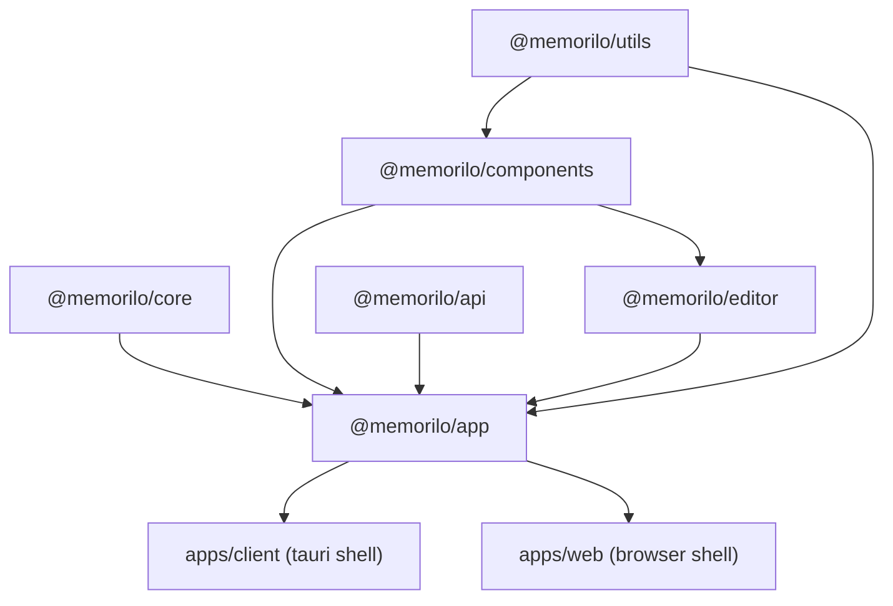

### Modules Graph

### Development workflow

This repo uses Turborepo as the task runner. The standard entrypoint is:

- `just dev-desktop`
  - Downloads required model/assets.
  - Runs `cargo tauri dev` (via nix if available).
  - Tauri runs `beforeDevCommand` from `src-tauri/tauri.conf.json` (`pnpm dev:desktop`).
  - `pnpm dev:desktop` runs **Turborepo** and starts:
    - `packages/app` route-tree generator (watch mode).
    - `packages/editor` Rollup watch.
    - `apps/client` Vite dev server.

You generally only need **one terminal** for desktop dev because Turbo watches editor builds and regenerates the route tree automatically.

If you want to run Vite directly (without Turbo), start the route generator first:

- `pnpm --filter @memorilo/app dev`
- `pnpm --filter @memorilo/client dev`
- `pnpm --filter @memorilo/web dev`

If you want to run every dev target (including web), use:

- `pnpm dev`

### Build workflow

All production builds start from the `just` targets:

- `just build-desktop`
  - Runs `cargo tauri build`.
  - Tauri runs `beforeBuildCommand` from `src-tauri/tauri.conf.json` (`just build-client`).
  - `just build-client` prepares web assets and runs `pnpm build`.
  - `pnpm build` runs **Turborepo** (`turbo run build`).

- `just build-android`
  - Runs `cargo tauri android build` (and split-per-abi).
  - Uses the same `beforeBuildCommand` chain above.

- `just build-ios`
  - Runs `cargo tauri ios build`.
  - Uses the same `beforeBuildCommand` chain above.

Turbo builds any package with a `build` script (currently `packages/app`, `packages/editor`, `apps/client`, and `apps/web`). The final desktop web output lives in `apps/client/dist`, which is what Tauri packages (`frontendDist`).

Notes:

- `packages/app/src/routeTree.gen.ts` is generated; do not edit it manually.
- `apps/client` is a thin Vite/Tauri shell that imports `@memorilo/app`.
- `apps/web` is a browser shell that imports `@memorilo/app`.
- Shared Vite plugins live in `vite-config` (package `@memorilo/vite-config`).
