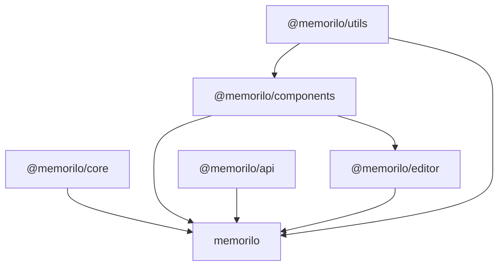

### Modules Graph

```mermaid
graph TD
    Core["@memorilo/core"]
    Client["memorilo"]
    Components["@memorilo/components"]
    API["@memorilo/api"]
    Editor["@memorilo/editor"]
    Utils["@memorilo/utils"]

    Core-->Client
    Components-->Client
    API-->Client
    Editor-->Client
    Components-->Editor
    Utils-->Components
    Utils-->Client
```
