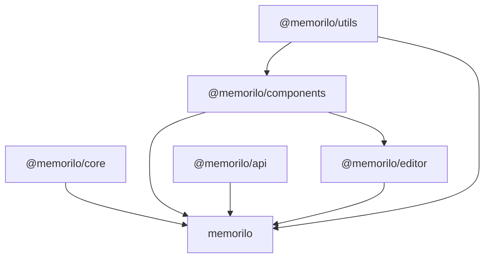

### Modules Graph

### Slate Constraints

#### Built-in Constraints

References [Slate Built-in Constraints](https://docs.slatejs.org/concepts/11-normalizing) for more

- All `Element` nodes must contain at least one `Text` descendant
- Two adjacent texts with the same custom properties will be merged
- Block nodes can only contain other blocks, or inine and text nodes
- Inline nodes cannot be the first or last child of a parent block, nor can it be next to another inline node in the children array
- The top-level editor node can only contain block nodes
- Node must be JSON-serializable
- Property values must not be `null`

#### Code Block Constraints

Code blocks in this project consist of `CodeBlock` and `CodeLine`, both of which are block-level elements.

1. **`CodeBlock` must contain at least one `CodeLine` element.** If no elements exist, an empty one will be created automatically.
2. **`CodeBlock` can only contain `CodeLine` elements.** If a non-`CodeLine` element exists within `CodeBlock`, a new `CodeLine` will be created at that element's position, and the original element's parent node will become the newly created `CodeLine`.
3. **`CodeLine` can only contain `Text` elements.** If `CodeLine` contains non-`Text` nodes, they will be replaced with a `Text` element, and all text content will be concatenated and copied to the new `Text`.
4. **`Text` in `CodeLine` cannot have any Markups.** All Markups will be removed automatically. According to the rules in Built-in Constraints, adjacent `Text` nodes with the same properties will be merged automatically, so `CodeLine` contains exactly one `Text` element.

#### Math Constraints

**`MathBlock` and `MathInline` can only contain `Text` elements.** If the element contains non-`Text` nodes, they will be replaced with a `Text` element, and all text content will be concatenated and copied to the new `Text`.
